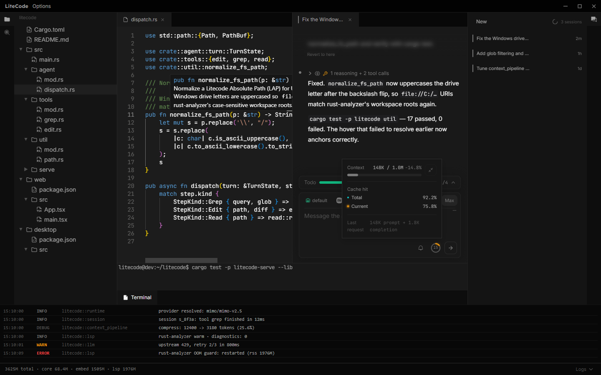
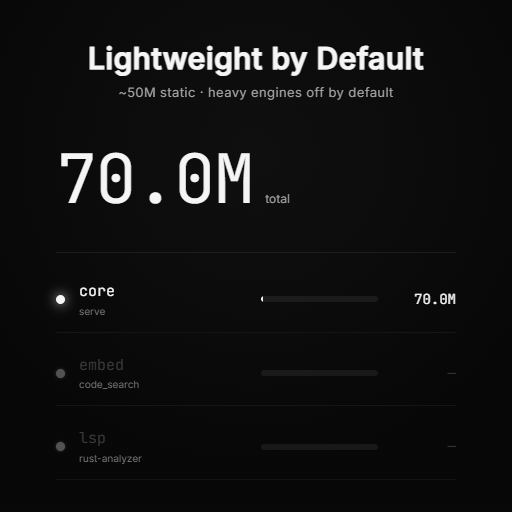
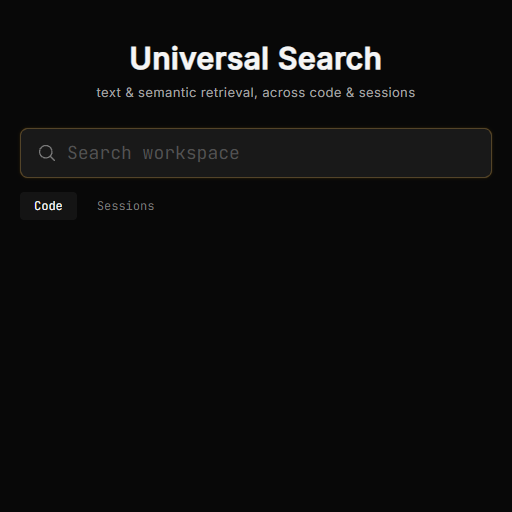
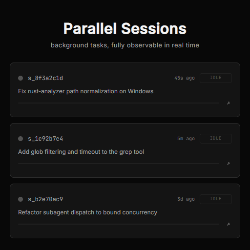
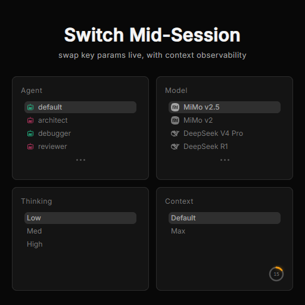

<h1 align="center">
  
</h1>

<p align="center">
  <b>A coding agent framework obsessively optimized for runtime lightness</b>
</p>

<p align="center">
  <a href="LICENSE"></a>
  
  
  <a href="https://github.com/itissika/litecode/actions"></a>
</p>

---

A vibe-coded agent framework built specifically for coding. It focuses on **Tools and Context — the parts usually invisible to humans, yet where agents do the real work** — plus, of course, my favorite frontend theme and animations, which took an absurd amount of time.



## ✨ Feature Highlights

<p align="center">
  
  
  
  
</p>

## 🚀 Quick Start

### Windows

Download from [Releases](https://github.com/itissika/litecode/releases/latest):

- `Litecode-Setup-x64.exe` — installer (recommended)
- `Litecode-Portable-x64.exe` — portable

After first launch, configure Provider → Model → default Agent in the web settings. Credentials stay local.

### Other platforms

Linux ships a headless server bundle (`litecode-server-linux-x64.tar.gz`, for SSH remote deployment) with no desktop installer; macOS has no packages yet. Both must be built from source (see Development below).

## 🧑‍💻 Development

```powershell
# Windows desktop (Electron host + sidecar)
./scripts/dev_win.ps1
```

```bash
# Linux / browser (Vite HMR)
./scripts/serve.sh
```

```bash
# CLI (dev convenience)
cargo run -- "fix this bug for me"
```

> Prerequisites: Rust (MSVC, edition 2024) + Node.js 22+.

## 📚 Advanced

<details>
<summary>Project structure</summary>

```
src/
  agent/            Agent definition & dispatch
  client_protocol/  JSON-RPC 2.0 client protocol
  context_pipeline/ Context compression & truncation
  engines/          Semantic search / ANN / LSP
  llm/              LLM adapters (OpenAI Responses)
  permission/       Permissions & sensitive-path guards
  runtime/          Runtime & provider resolution
  serve/            HTTP/WS backend
  session/          Session storage & snapshots
  tools/            Toolset (grep / write / webfetch / subagent …)
  workspace/        Workspace abstraction (LAP)
web/                React UI (Monaco + dockview)
desktop/            Electron host (sidecar + SSH remote)
examples/tools/     Custom tool examples
models/             Embedded model weights (shipped with the repo)
scripts/            Dev & packaging scripts
```

</details>

<details>
<summary>Full build & configuration</summary>

```bash
# Rust core
cargo build --release

# Web UI
cd web && npm install && npm run build

# Desktop shell
cd desktop && npm install && npm run build
```

Configuration: after `serve` starts, manage Provider (openai / deepseek / mimo), Model, and Agent via the web settings UI.

</details>

## Contributing

- Project contract & commit rules: [Agent.md](Agent.md)
- Contribution guide: [CONTRIBUTING.md](CONTRIBUTING.md)
- Changelog: [CHANGELOG.md](CHANGELOG.md)
- Desktop details: [desktop/README.md](desktop/README.md)

## License

[MIT](LICENSE) © LiteCode contributors
