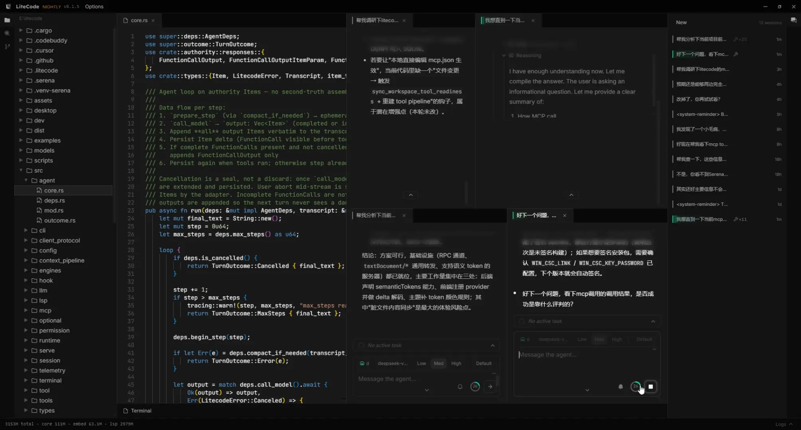

<h1 align="center">
  
</h1>

<p align="center">
  <b>追求运行时极致轻量的 Coding Agent 框架</b>
</p>

<p align="center">
  <a href="LICENSE"></a>
  
  
  <a href="https://github.com/itissika/litecode/actions"></a>
</p>

---

一坨 Vibe Coding 出来的、专门针对 Coding 场景的 Agent 框架。专注于：**Tool 和 Context 这些经常对人类不可见但是 agent 主战场的实现**，当然，还有我最喜欢的前端主题和动画，花了我超多时间。



## ✨ 功能亮点

**开销随需** — 核心常驻 ~50MB，默认极致轻量；按需叠加语义搜索 / LSP / 远程等能力，亦可极重。

### 🤖 Agent
- **并行执行** — 多 Session 并行 + 并发子代理（不可嵌套），互不阻塞。
- **自由编排** — 主 / 子 Agent 按需增加，各自注册任意数量的工具集与 system prompt。
- **工具自由扩展** — 内置工具集之外，支持自定义工具与 MCP 服务器，注册即用。
- **工具热插拔** — 保存设置下一轮即生效，无需重启 serve。
- **LSP 完整体验** — 开启后 write / edit 自动获得诊断反馈，Agent 拥有人类编辑代码般的完整体验。
- **安全策略** — 内置工具自带授权预设一键切换；敏感路径防护，Session 快照支持运行中 Revert。
- **上下文压缩** — 自动或一键手动；keep-recent 自动保留关键内容，内置 `session_search` tool 无损召回历史。

### 🖥️ IDE
- **轻量编辑** — 内嵌 Monaco 编辑器即开即用；IDE 能力即 Agent 能力，优先供给 Agent 侧。
- **语义搜索** — 按语义而非文本匹配代码（200+ 语言，ANN + tree-sitter）。
- **双形态 + 远程** — Electron 桌面端与浏览器端；SSH 部署 Linux 无头服务端，隧道回连。

### 🔌 Provider
- **多适配器** — OpenAI Responses 为唯一权威格式，openai / deepseek / mimo 即插即用。
- **运行中切换** — 中途换模型 / Agent 不丢上下文，下一轮生效。
- **成本可见** — prompt / completion / cache hit / miss 按 step 实时统计，精准控制成本。

## 🚀 快速开始

### Windows

前往 [Releases](https://github.com/itissika/litecode/releases/latest) 下载安装包：

- `Litecode-Setup-x64.exe` — 安装版（推荐）
- `Litecode-Portable-x64.exe` — 免安装便携版

首次启动后在 Web 设置界面配置 Provider → Model → 默认 Agent，凭据只存本机。

### 其他平台

Linux 提供无头服务端包（`litecode-server-linux-x64.tar.gz`，供 SSH 远程部署），无桌面安装包；macOS 暂无任何安装包。两者均需从源码构建（见下方「开发」）。

## 🧑‍💻 开发

```powershell
# Windows 桌面端（Electron 宿主 + sidecar）
./scripts/dev_win.ps1
```

```bash
# Linux / 浏览器端（Vite 热更）
./scripts/serve.sh
```

```bash
# CLI（开发便利）
cargo run -- "帮我修复这个 bug"
```

> 前置要求：Rust（MSVC，edition 2024）+ Node.js 22+。

## 📚 进阶

<details>
<summary>项目结构</summary>

```
src/
  agent/            Agent 定义与调度
  client_protocol/  JSON-RPC 2.0 客户端协议
  context_pipeline/ 上下文压缩与截断
  engines/          语义搜索 / ANN / LSP
  llm/              LLM 适配器（OpenAI Responses）
  permission/       权限与敏感路径防护
  runtime/          运行时与 provider 解析
  serve/            HTTP/WS 后端
  session/          Session 存储与快照
  tools/            工具集（grep / write / webfetch / subagent …）
  workspace/        工作区抽象（LAP）
web/                React UI（Monaco + dockview）
desktop/            Electron 宿主（sidecar + SSH 远程）
examples/tools/     自定义工具示例
models/             嵌入模型权重（随仓分发）
scripts/            开发与打包脚本
```

</details>

<details>
<summary>完整构建 & 配置</summary>

```bash
# Rust 核心
cargo build --release

# Web UI
cd web && npm install && npm run build

# Desktop 壳
cd desktop && npm install && npm run build
```

配置入口：`serve` 启动后通过 Web 设置界面管理 Provider（openai / deepseek / mimo）、Model、Agent。

</details>

## 参与贡献

- 项目契约与提交铁律：[Agent.md](Agent.md)
- 贡献流程：[CONTRIBUTING.md](CONTRIBUTING.md)
- 版本变更：[CHANGELOG.md](CHANGELOG.md)
- 桌面端细节：[desktop/README.md](desktop/README.md)

## License

[MIT](LICENSE) © LiteCode contributors
