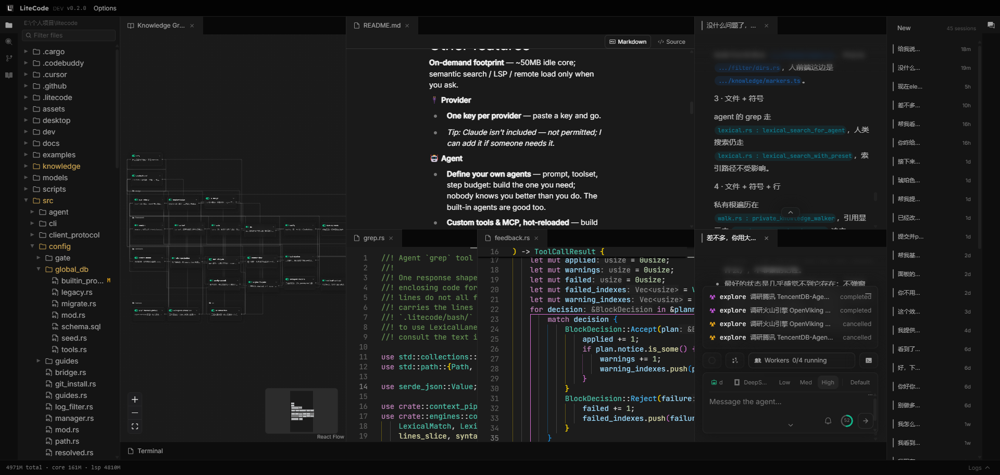
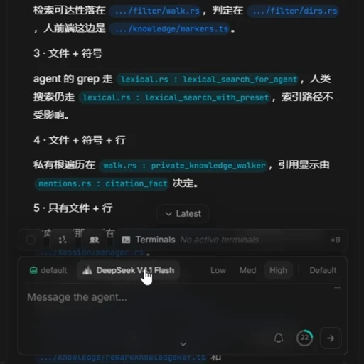
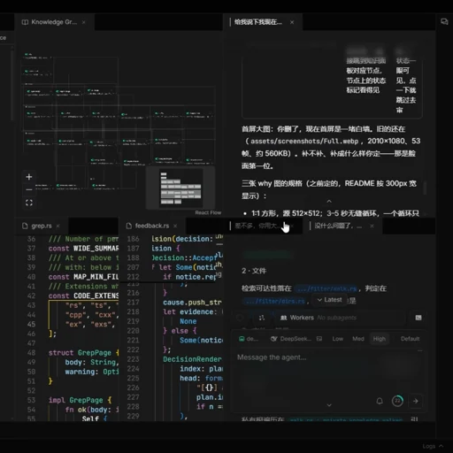
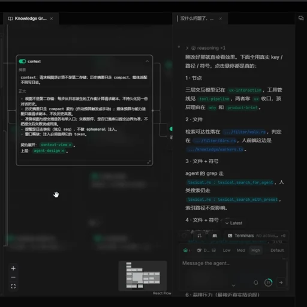

<h1 align="center">
  
</h1>

<p align="center">
  <b>轻量的桌面 Coding Agent 工作台</b>
</p>

<p align="center">
  <a href="LICENSE"></a>
  
  
  
  <a href="https://github.com/itissika/litecode/actions"></a>
</p>

<p align="center">
  <a href="./README.md">English</a> · <a href="./README.zh-CN.md">简体中文</a>
</p>

***



## 🚀 上手

1. [下载](https://github.com/itissika/litecode/releases/latest)
2. 填一个 key

**你已经就绪啦！**

macOS 暂不支持；桌面端只有 Windows，Linux 只有无头包。

## 为什么是 LiteCode

<table>
  <tr>
    <td align="center" width="33%">
      <br><br>
      <b>不封闭</b> — 谁家的 key 都能用；聊到一半也能换，不怕平台锁生态。
    </td>
    <td align="center" width="33%">
      <br><br>
      <b>随便摆</b> — 主 / 子代理、编辑器、知识库，想怎么干活就怎么摆。
    </td>
    <td align="center" width="33%">
      <br><br>
      <b>知识实时</b> — 状态一眼可见，对话里点一下就跳过去审。
    </td>
  </tr>
</table>

### 其他特性

**开销随需** — 核心常驻 \~50MB；语义搜索 / LSP / 远程按需装载。

**🔌 Provider**

* **一个供应商一个 key** — key 填了就能用。
* *tip：Claude 系列没加——不让用；有人需要我可以加上。*

**🤖 Agent**

* **Agent 自定义** — 提示词、工具集、步数，需要谁自己造；最懂你的是你自己。内置 agent 也很好用。
* **Custom tool / MCP 热更新** — 要什么 tool 自己造，造好立刻能用；烂大街的那些配不上你。
* **LSP 自动回填** — 写错的代码，当前轮次立刻反馈给 agent；不劳你和 agent 费心。
* **思考强度 / 上下文一键切换** — 3 档思考强度、2 档上下文；超窗自动压缩，工作不中断。
* **工作区全仓会话检索** — 给 agent 加个记忆外挂；说了什么都能捞回来。

**🧠 知识库**

* **节点式知识，稳定引用** — 牵一发而动全身，窥一点而知全貌；借知识库，像战略家一样指导全局吧。
* **知识是活的** — 永远跟着事实走，不漏掉你和 agent 对文件 / 代码的每一次编辑；别让你的知识过时。

**🖥️ IDE**

* **文件树 + 编辑器** — 轻量代码编辑；LSP 启动时，获得完整的编辑体验。
* **多格式预览** — 文本、代码、图片、PDF、SQLite，点了直接看。

## 🧭 设计

LiteCode 只为一个人、一个工作区而造。**我们只提供工具**——agent 不是全能的，它也不会是你自己；只有你知道你想做什么。所以它刻意不做：一个窗口多工作区、自动化唤醒的任务、skill、方便功能的堆砌。

LiteCode 的设计理念就沉淀在它自己的知识库里——`knowledge/`，正是产品内置的那个功能。建议从 [为什么](./knowledge/why.md) → [产品概要](./knowledge/product-brief.md) → [harness 顶层设计](./knowledge/harness/agent-harness-philosophy.md) 读起，再看理念落成的[特色工具集](./knowledge/framework/featured-tools.md)。

## 🧑‍💻 开发

```powershell
# Windows 桌面端（Electron 宿主 + sidecar）
./scripts/dev_win.ps1
```

```bash
# Linux / 浏览器端（Vite 热更）
./scripts/serve.sh
```

> 前置要求：Rust（MSVC，edition 2024）+ Node.js 22+。

本地 nightly（Windows 安装包 + 精简 Linux tar，`LITECODE_CHANNEL=nightly`）：

```powershell
./scripts/package_local.ps1
```

产物：`desktop/out/` 与 `dist/linux/`。官方签名版本来自 GitHub Releases。

## 📚 进阶

<details>
<summary>项目结构</summary>

```
src/
  agent/            Agent 循环与调度（控制流冻结）
  tool/             工具管线：唯一执行 / 授权 / 输出合约
  tools/            内置工具集（read / grep / edit / bash / subagent / knowledge …）
  context_pipeline/ 上下文视图、压缩与截断
  session/          Session 日志（seq 权威）、快照与回退
  knowledge/        知识库：语料、引用、校验
  engines/          语义搜索 / ANN / LSP 生命周期
  llm/              LLM 适配器（OpenAI Responses 权威格式）
  provider_catalog/ 提供商与模型目录（随构建内嵌）
  runtime/          运行时句柄与 provider 解析
  permission/       权限与敏感路径防护
  reminder/         系统提醒（作为会话事实写入）
  terminal/         PTY 基座
  workspace/        工作区基座（文件 / git / 共享基础设施）
  mcp/              MCP 服务器
  serve/            HTTP/WS 后端
  client_protocol/  JSON-RPC 2.0 客户端协议
web/                React UI（Monaco + dockview）
desktop/            Electron 宿主（sidecar + SSH 远程）
examples/tools/     自定义工具示例
models/             嵌入模型权重（随仓分发）
knowledge/          LiteCode 自己的设计知识（吃自己的狗粮）
scripts/            开发与打包脚本
```

</details>

<details>
<summary>完整构建 & 配置</summary>

```bash
# Rust 核心
cargo build --release

# Web UI
cd web && npm install && npm run build

# Desktop 壳
cd desktop && npm install && npm run build
```

配置入口：`serve` 启动后通过 Web 设置界面管理 Provider、Model 与 Agent。

</details>

## 参与贡献

Vibe Coding 出来的，有 bug 是常事——我尽力了。欢迎 issue 与 PR。

* 项目契约与提交铁律：[AGENTS.md](AGENTS.md)
* 贡献流程：[CONTRIBUTING.md](CONTRIBUTING.md)
* 版本变更：[CHANGELOG.md](CHANGELOG.md)
* 桌面端细节：[desktop/README.md](desktop/README.md)

## License

[MIT](LICENSE) © LiteCode contributors
